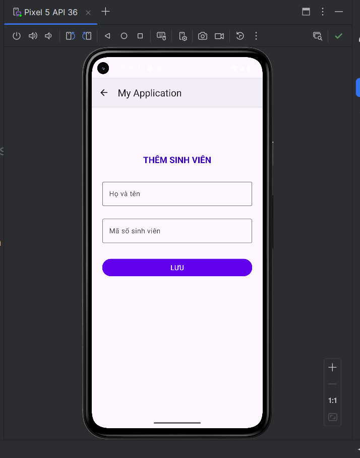
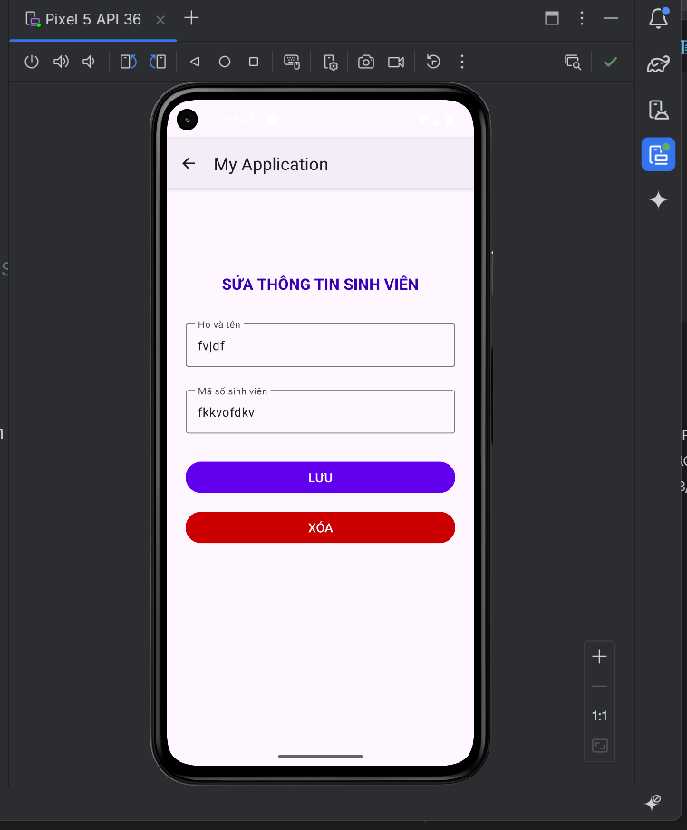
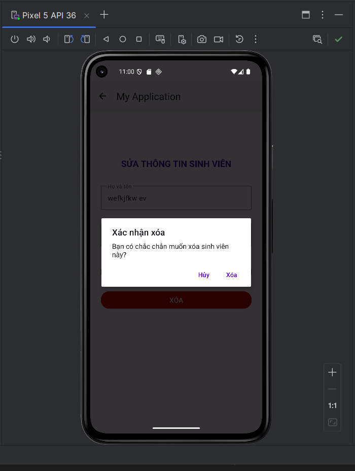

# 📱 Ứng dụng Quản Lý Sinh Viên (Android - Kotlin)

Ứng dụng mobile được phát triển bằng **Android Studio** sử dụng **Kotlin**, cho phép quản lý danh sách sinh viên với các chức năng cơ bản như thêm, sửa và xóa.  
Giao diện được thiết kế đơn giản, dễ sử dụng và trực quan.  

---

## 🚀 Công nghệ sử dụng
- **Ngôn ngữ**: Kotlin  
- **IDE**: Android Studio  
- **UI**: RecyclerView, Material Design  

---

## 🖼️ Giao diện ứng dụng

### 🔹 Màn hình chính


### 🔹 Thêm sinh viên


### 🔹 Sửa thông tin sinh viên


### 🔹 Xóa sinh viên


---

## ⚙️ Chức năng chính
- 📋 **Hiển thị danh sách sinh viên**  
- ➕ **Thêm sinh viên mới**  
- ✏️ **Chỉnh sửa thông tin sinh viên**  
- ❌ **Xóa sinh viên khỏi danh sách**  

---

## 📦 Cài đặt và chạy ứng dụng
1. Clone project về máy:
   ```bash
   git clone https://github.com/your-repo/student-management-app.git
