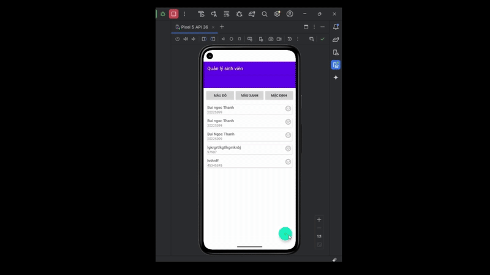
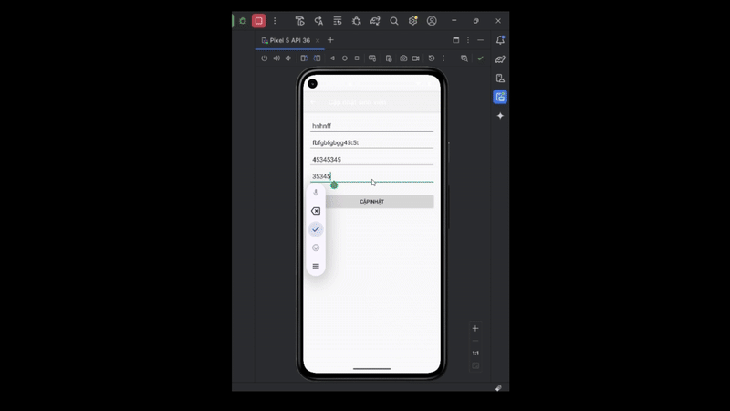
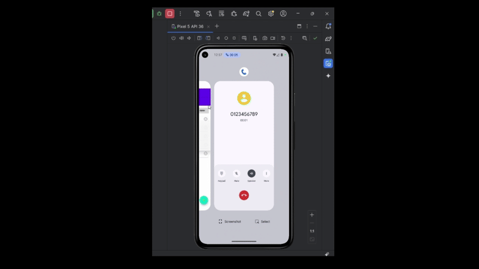

# 📱 Ứng dụng Quản Lý Sinh Viên (Android - Kotlin)

Ứng dụng mobile được phát triển bằng **Android Studio** sử dụng **Kotlin**, cho phép quản lý danh sách sinh viên với các chức năng cơ bản như thêm, sửa, xóa và cập nhật.  
Ngoài ra, ứng dụng còn hỗ trợ liên kết với các ứng dụng khác trên điện thoại như **Mail** và **Call**.  
Giao diện được thiết kế đơn giản, dễ sử dụng và trực quan.  

---

## 🚀 Công nghệ sử dụng
- **Ngôn ngữ**: Kotlin  
- **IDE**: Android Studio  
- **UI**: RecyclerView, Material Design  
- **Thư viện bổ sung**: Examples_CQ  

---

## 🖼️ Giao diện ứng dụng (Demo Video)





---

## ⚙️ Chức năng chính
- 📋 **Hiển thị danh sách sinh viên**  
- ➕ **Thêm sinh viên mới**  
- ✏️ **Chỉnh sửa thông tin sinh viên**  
- 🔄 **Cập nhật thông tin sinh viên**  
- ❌ **Xóa sinh viên khỏi danh sách**  
- 📧 **Gửi email trực tiếp từ ứng dụng**  
- 📞 **Gọi điện cho sinh viên ngay trên ứng dụng**  

---

## 📦 Cài đặt và chạy ứng dụng
1. Clone project về máy:
   ```bash
   git clone https://github.com/your-repo/student-management-app.git
